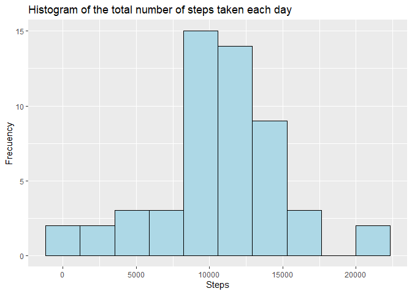
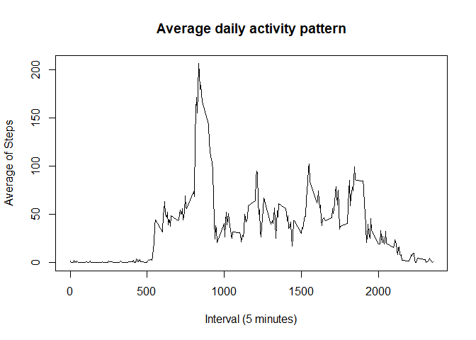
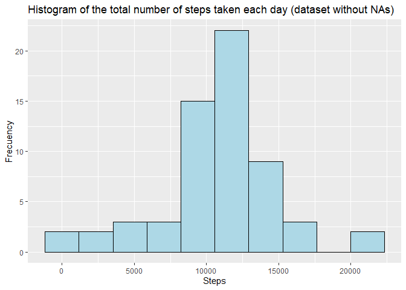
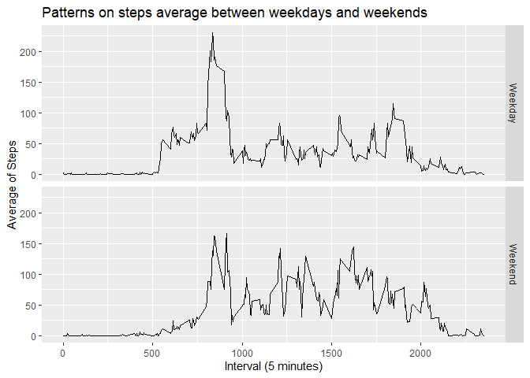

Loading and preprocessing the data
----------------------------------

**1.Load the data**  
The data was unziped first, and then loaded whit the function read.csv()

    unzip(zipfile = "activity.zip")
    StepsData<-read.csv("activity.csv",header = TRUE)
    #The format of the data was: 
    head(StepsData)

    ##   steps       date interval
    ## 1    NA 2012-10-01        0
    ## 2    NA 2012-10-01        5
    ## 3    NA 2012-10-01       10
    ## 4    NA 2012-10-01       15
    ## 5    NA 2012-10-01       20
    ## 6    NA 2012-10-01       25

What is mean total number of steps taken per day?
-------------------------------------------------

**1. Total number of steps taken per day**  
The sum of steps in each day was obtained with the following code.

    StepsPerDay<-aggregate(steps~date,StepsData,sum)
    library(knitr)
    kable(StepsPerDay)

<table>
<thead>
<tr class="header">
<th style="text-align: left;">date</th>
<th style="text-align: right;">steps</th>
</tr>
</thead>
<tbody>
<tr class="odd">
<td style="text-align: left;">2012-10-02</td>
<td style="text-align: right;">126</td>
</tr>
<tr class="even">
<td style="text-align: left;">2012-10-03</td>
<td style="text-align: right;">11352</td>
</tr>
<tr class="odd">
<td style="text-align: left;">2012-10-04</td>
<td style="text-align: right;">12116</td>
</tr>
<tr class="even">
<td style="text-align: left;">2012-10-05</td>
<td style="text-align: right;">13294</td>
</tr>
<tr class="odd">
<td style="text-align: left;">2012-10-06</td>
<td style="text-align: right;">15420</td>
</tr>
<tr class="even">
<td style="text-align: left;">2012-10-07</td>
<td style="text-align: right;">11015</td>
</tr>
<tr class="odd">
<td style="text-align: left;">2012-10-09</td>
<td style="text-align: right;">12811</td>
</tr>
<tr class="even">
<td style="text-align: left;">2012-10-10</td>
<td style="text-align: right;">9900</td>
</tr>
<tr class="odd">
<td style="text-align: left;">2012-10-11</td>
<td style="text-align: right;">10304</td>
</tr>
<tr class="even">
<td style="text-align: left;">2012-10-12</td>
<td style="text-align: right;">17382</td>
</tr>
<tr class="odd">
<td style="text-align: left;">2012-10-13</td>
<td style="text-align: right;">12426</td>
</tr>
<tr class="even">
<td style="text-align: left;">2012-10-14</td>
<td style="text-align: right;">15098</td>
</tr>
<tr class="odd">
<td style="text-align: left;">2012-10-15</td>
<td style="text-align: right;">10139</td>
</tr>
<tr class="even">
<td style="text-align: left;">2012-10-16</td>
<td style="text-align: right;">15084</td>
</tr>
<tr class="odd">
<td style="text-align: left;">2012-10-17</td>
<td style="text-align: right;">13452</td>
</tr>
<tr class="even">
<td style="text-align: left;">2012-10-18</td>
<td style="text-align: right;">10056</td>
</tr>
<tr class="odd">
<td style="text-align: left;">2012-10-19</td>
<td style="text-align: right;">11829</td>
</tr>
<tr class="even">
<td style="text-align: left;">2012-10-20</td>
<td style="text-align: right;">10395</td>
</tr>
<tr class="odd">
<td style="text-align: left;">2012-10-21</td>
<td style="text-align: right;">8821</td>
</tr>
<tr class="even">
<td style="text-align: left;">2012-10-22</td>
<td style="text-align: right;">13460</td>
</tr>
<tr class="odd">
<td style="text-align: left;">2012-10-23</td>
<td style="text-align: right;">8918</td>
</tr>
<tr class="even">
<td style="text-align: left;">2012-10-24</td>
<td style="text-align: right;">8355</td>
</tr>
<tr class="odd">
<td style="text-align: left;">2012-10-25</td>
<td style="text-align: right;">2492</td>
</tr>
<tr class="even">
<td style="text-align: left;">2012-10-26</td>
<td style="text-align: right;">6778</td>
</tr>
<tr class="odd">
<td style="text-align: left;">2012-10-27</td>
<td style="text-align: right;">10119</td>
</tr>
<tr class="even">
<td style="text-align: left;">2012-10-28</td>
<td style="text-align: right;">11458</td>
</tr>
<tr class="odd">
<td style="text-align: left;">2012-10-29</td>
<td style="text-align: right;">5018</td>
</tr>
<tr class="even">
<td style="text-align: left;">2012-10-30</td>
<td style="text-align: right;">9819</td>
</tr>
<tr class="odd">
<td style="text-align: left;">2012-10-31</td>
<td style="text-align: right;">15414</td>
</tr>
<tr class="even">
<td style="text-align: left;">2012-11-02</td>
<td style="text-align: right;">10600</td>
</tr>
<tr class="odd">
<td style="text-align: left;">2012-11-03</td>
<td style="text-align: right;">10571</td>
</tr>
<tr class="even">
<td style="text-align: left;">2012-11-05</td>
<td style="text-align: right;">10439</td>
</tr>
<tr class="odd">
<td style="text-align: left;">2012-11-06</td>
<td style="text-align: right;">8334</td>
</tr>
<tr class="even">
<td style="text-align: left;">2012-11-07</td>
<td style="text-align: right;">12883</td>
</tr>
<tr class="odd">
<td style="text-align: left;">2012-11-08</td>
<td style="text-align: right;">3219</td>
</tr>
<tr class="even">
<td style="text-align: left;">2012-11-11</td>
<td style="text-align: right;">12608</td>
</tr>
<tr class="odd">
<td style="text-align: left;">2012-11-12</td>
<td style="text-align: right;">10765</td>
</tr>
<tr class="even">
<td style="text-align: left;">2012-11-13</td>
<td style="text-align: right;">7336</td>
</tr>
<tr class="odd">
<td style="text-align: left;">2012-11-15</td>
<td style="text-align: right;">41</td>
</tr>
<tr class="even">
<td style="text-align: left;">2012-11-16</td>
<td style="text-align: right;">5441</td>
</tr>
<tr class="odd">
<td style="text-align: left;">2012-11-17</td>
<td style="text-align: right;">14339</td>
</tr>
<tr class="even">
<td style="text-align: left;">2012-11-18</td>
<td style="text-align: right;">15110</td>
</tr>
<tr class="odd">
<td style="text-align: left;">2012-11-19</td>
<td style="text-align: right;">8841</td>
</tr>
<tr class="even">
<td style="text-align: left;">2012-11-20</td>
<td style="text-align: right;">4472</td>
</tr>
<tr class="odd">
<td style="text-align: left;">2012-11-21</td>
<td style="text-align: right;">12787</td>
</tr>
<tr class="even">
<td style="text-align: left;">2012-11-22</td>
<td style="text-align: right;">20427</td>
</tr>
<tr class="odd">
<td style="text-align: left;">2012-11-23</td>
<td style="text-align: right;">21194</td>
</tr>
<tr class="even">
<td style="text-align: left;">2012-11-24</td>
<td style="text-align: right;">14478</td>
</tr>
<tr class="odd">
<td style="text-align: left;">2012-11-25</td>
<td style="text-align: right;">11834</td>
</tr>
<tr class="even">
<td style="text-align: left;">2012-11-26</td>
<td style="text-align: right;">11162</td>
</tr>
<tr class="odd">
<td style="text-align: left;">2012-11-27</td>
<td style="text-align: right;">13646</td>
</tr>
<tr class="even">
<td style="text-align: left;">2012-11-28</td>
<td style="text-align: right;">10183</td>
</tr>
<tr class="odd">
<td style="text-align: left;">2012-11-29</td>
<td style="text-align: right;">7047</td>
</tr>
</tbody>
</table>

**2. Histogram of the data distribution**

    library(ggplot2)
    ggplot(StepsPerDay,aes(x=steps))+geom_histogram(bins = 10,color="black",fill="lightblue")+ylab("Frecuency")+xlab("Steps")+labs(title="Histogram of the total number of steps taken each day")  

**3. The mean and median of the total number of steps taken per day**

    library(xtable)
    Mean<-mean(StepsPerDay$steps)
    Median<-median(StepsPerDay$steps)
    MeanMedian<-cbind(Mean,Median)
    MeanAndMedian<-xtable(MeanMedian)
    rownames(MeanAndMedian)<-c("Results")
    print(MeanAndMedian,type="html")

<!-- html table generated in R 4.0.2 by xtable 1.8-4 package -->
<!-- Thu Oct 08 23:24:24 2020 -->
<table border="1">
<tr>
<th>
</th>
<th>
Mean
</th>
<th>
Median
</th>
</tr>
<tr>
<td align="right">
Results
</td>
<td align="right">
10766.19
</td>
<td align="right">
10765.00
</td>
</tr>
</table>

What is the average daily activity pattern?
-------------------------------------------

**1. Time series plot of the 5-minute interval and the average number of
steps taken, averaged across all days**

    StepsPerInterval<-aggregate(steps~interval,StepsData,mean)
    plot(StepsPerInterval$interval,StepsPerInterval$steps,type = "l",ylab = "Average of Steps",xlab = "Interval (5 minutes)",main = "Average daily activity pattern")

**2. Which 5-minute interval, on average across all the days in the
dataset, contains the maximum number of steps?**

    library(xtable)
    maxstepsint<-xtable(StepsPerInterval[StepsPerInterval$steps==max(StepsPerInterval$steps),])
    rownames(maxstepsint)<-c("")
    colnames(maxstepsint)<-c("Interval","Steps")
    print(maxstepsint,type="html")

<!-- html table generated in R 4.0.2 by xtable 1.8-4 package -->
<!-- Thu Oct 08 23:24:24 2020 -->
<table border="1">
<tr>
<th>
</th>
<th>
Interval
</th>
<th>
Steps
</th>
</tr>
<tr>
<td align="right">
</td>
<td align="right">
835
</td>
<td align="right">
206.17
</td>
</tr>
</table>

Imputing missing values
-----------------------

**1. Total number of missing values in the dataset**

    totalNA<-sum(is.na(StepsData$steps),is.na(StepsData$date),is.na(StepsData$interval))

The total of missing values in the dataset is: 2304

**2. A strategy for filling in all of the missing values in the
dataset**  
The strategy is use the steps mean of each 5-minute interval to replace
the missing values in the variable “steps”

**3. A new dataset that is equal to the original dataset but with the
missing data filled in**

    StepsDataNoNA<-StepsData
    n<-length(StepsDataNoNA$steps)
    for (i in 1:n) {
        if(is.na(StepsDataNoNA$steps[i])){
            StepsDataNoNA[i,1]<-StepsPerInterval$steps[StepsPerInterval$interval==StepsDataNoNA$interval[i]]
        }
    }
    tNa<-sum(is.na(StepsDataNoNA$steps))

Now into the dataset are 0 missing values

**4. An histogram of the total number of steps taken each day. The mean
and median total number of steps taken per day. Do these values differ
from the estimates from the first part of the assignment? What is the
impact of imputing missing data on the estimates of the total daily
number of steps?**

    StepsPerDayNoNA<-aggregate(steps~date,StepsDataNoNA,sum)
    ggplot(StepsPerDayNoNA,aes(x=steps))+geom_histogram(bins = 10,color="black",fill="lightblue")+ylab("Frecuency")+xlab("Steps")+labs(title="Histogram of the total number of steps taken each day (dataset without NAs)")

Now compare the mean and median total number of steps taken per day:

    Mean<-mean(StepsPerDay$steps)
    Median<-median(StepsPerDay$steps)

    MeanN<-mean(StepsPerDayNoNA$steps)
    MedianN<-median(StepsPerDayNoNA$steps)

The mean from dataset with missing values and the mean from the dataset
with the missing data filled in are the same:  
1.076618910^{4} = 1.076618910^{4}  
The median from dataset with missing values and the median from the
dataset with the missing data filled in are not the same:  
10765 are not equal to 1.076618910^{4}  
Fill the missing values of the dataset impact the frequency of the total
number of steps taken each day, also change the median, but the mean
stay the same.

Are there differences in activity patterns between weekdays and weekends?
-------------------------------------------------------------------------

    StepsDataNoNA$date<-as.Date(StepsDataNoNA$date,"%Y-%m-%d")
    l<-length(StepsDataNoNA$date)
    TypeWeekDay<-data.frame()

    for (c in 1:l) {
        if(weekdays(StepsDataNoNA$date[c]) %in% c("Saturday", "Sunday")){
            TypeWeekDay[c,1]<-c("Weekend")
        }else{
            TypeWeekDay[c,1]<-c("Weekday")
        }
    }

    colnames(TypeWeekDay)<-c("TypeWeekDay")
    StepsDataNoNA<-cbind(StepsDataNoNA,TypeWeekDay)
    StepsDataNoNAmean<-aggregate(steps~interval+TypeWeekDay,StepsDataNoNA,mean)
    head(StepsDataNoNAmean)

    ##   interval TypeWeekDay      steps
    ## 1        0     Weekday 2.25115304
    ## 2        5     Weekday 0.44528302
    ## 3       10     Weekday 0.17316562
    ## 4       15     Weekday 0.19790356
    ## 5       20     Weekday 0.09895178
    ## 6       25     Weekday 1.59035639

**2. Panel plot containing a time series plot of the 5-minute interval
(x-axis) and the average number of steps taken, averaged across all
weekday days or weekend days (y-axis).**

    library(ggplot2)
    ggplot(StepsDataNoNAmean,aes(x = interval,y = steps)) + geom_line() + facet_grid(TypeWeekDay~.) + labs(title = "Patterns on steps average between weekdays and weekends") + ylab("Average of Steps") + xlab("Interval (5 minutes)")

